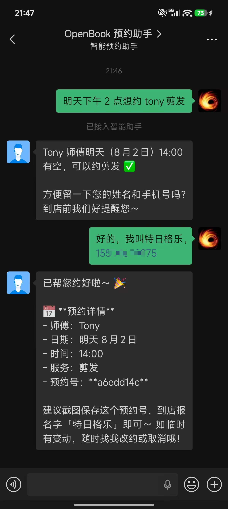
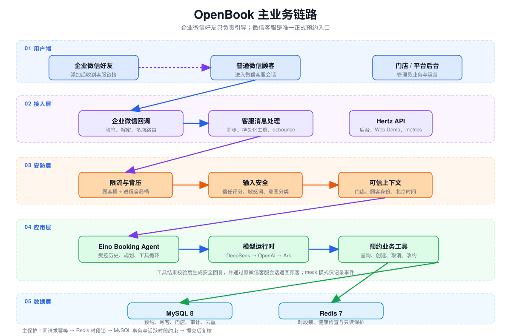
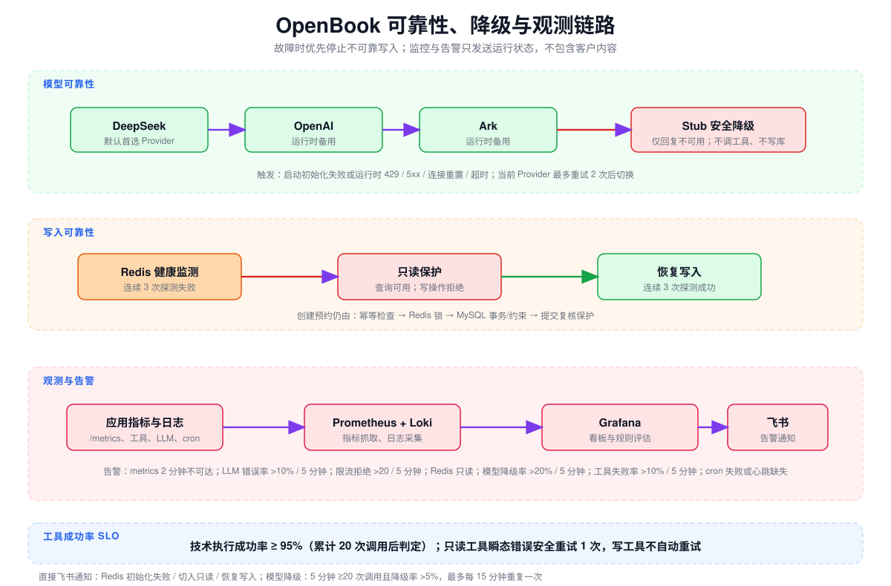
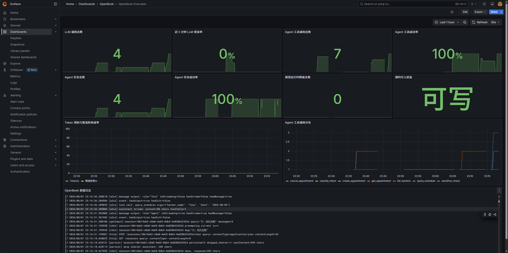

# OpenBook · 微信一句话预约的 Agent MVP

> 一个用 Go 与 CloudWeGo Eino 构建的美发门店预约 Agent：将自然语言请求安全地转换为可校验、可执行的预约业务操作。

[](https://go.dev)
[](https://github.com/cloudwego/eino)
[](.)
[](LICENSE)

## 30 秒了解项目

OpenBook 不是通用聊天机器人，而是验证 Agent 如何在真实业务里可靠落地的可运行 Demo / MVP。用户可以在微信客服中说“明天下午 2 点想约 Tony 剪发”，系统完成意图识别、受限工具调用、库存/档期校验、事务写入与结果回复。

| 关注点 | 项目中的实现 |
| --- | --- |
| Agent 编排 | 基于 Eino ADK / compose 支持多轮对话、流式回复与白名单工具调用 |
| 业务可靠性 | 幂等检查、Redis 时段锁、MySQL 事务与提交后复核，避免并发撞单 |
| 安全边界 | 服务端注入门店与顾客身份；工具层校验租户隔离、资源归属和操作权限 |
| 失败降级 | 多模型降级链、Stub 安全降级、Redis 异常时只读保护；无法确认结果不回复成功 |
| 可观测性 | Prometheus、Loki、Grafana 与 SLO 指标；覆盖模型、工具、限流和 Redis 状态 |
| RAG 实验 | 面向低频、单文档问答的独立实验流程；预约等确定性业务不依赖 RAG 决策 |

### 企业微信预约 Demo

用户提出预约请求后，Agent 查询可约时段、补齐必要的顾客资料，再创建预约并返回短预约号。



**快速查看：** [架构与安全边界](docs/架构说明.md) · [离线 Agent 评测](docs/evals/README.md) · [工程取舍与复盘](docs/engineering/工程问题复盘.md) · [压测口径](docs/benchmarks.md) · [本地启动](#快速开始)

## 项目定位

这是一个可运行的本地 Demo / MVP，不宣称生产就绪。它用美发预约验证 Agent 在真实业务中最容易出错的几个环节：相对日期理解、结构化工具调用、并发撞单、身份归属与失败兜底。

顾客无需安装企业微信。正式的预约业务入口为门店的**微信客服会话**：顾客可直接点击客服链接或扫描客服二维码进入；添加店主或理发师的企业微信好友后，系统会自动发送包含客服链接的欢迎语，引导顾客进入客服会话。企业微信好友仅承担引导，不作为新门店的正式预约入口。

## 架构说明

完整的六层架构、模块职责、降级条件、数据边界和告警规则见[架构说明](docs/架构说明.md)。

### 主业务链路



### 可靠性与观测



```text
顾客：明天下午 2 点想约 Tony 剪发
Agent：识别日期与意图 → 查询可约时段 → 创建预约 → 写入 MySQL → 返回确认结果
```

## 项目结构

- `main.go`、`server/`：应用启动、HTTP 接口、会话处理、限流与回复流程。
- `internal/agent/`、`tools/`：Agent 编排及受限的预约业务工具。
- `storage/`、`lock/`：MySQL 持久化、Redis 锁、事务与租户/归属校验。
- `chatmodel/`、`intent/`、`sensitive/`：模型适配与降级、意图识别、输入保护。
- `wecom/`、`cron/`、`notify/`：企业微信、定时任务与通知。
- `api/`、`auth/`、`static/`、`web/`：商户后台、认证与前端页面。
- `docs/`：产品、容器、部署、基准和工程复盘。

## 核心实现

- 正式入口为微信客服：好友添加事件只发送客服链接；客服消息经验签、解密、多店路由、持久化去重和 debounce 后进入 Agent。
- Agent 仅可调用白名单预约工具；门店、顾客身份与北京时间由服务端上下文注入，并在工具层校验门店隔离和预约归属。
- 创建预约依次经过幂等检查、Redis 时段锁、MySQL 事务/活跃时段约束和提交后复核；无法确认结果时不回复成功。
- 请求先经过每顾客限流（默认 `1 req/s`、突发 `5`）和进程全局限流（默认 `100 req/s`、突发 `200`）。当前没有门店聚合总量限流。
- 默认模型链为 DeepSeek → OpenAI → Ark。启动或运行时全部模型不可用时使用 Stub 安全降级：不调用工具、不写库；只读工具的瞬态错误最多安全重试一次，写工具不自动重试。
- Redis 连续 3 次健康检查失败时进入只读保护，连续 3 次成功后恢复；查询仍可用，写操作会安全拒绝。

## 可观测性

Docker Compose 默认仅启动应用、MySQL、Redis 和数据库初始化，适合低配线上服务器。可观测性栈位于 `observability` profile，需在本地显式启动：`docker compose --profile observability up -d`。启用后，应用的 `/metrics` 由 Prometheus 每 15 秒抓取；Grafana Alloy（Promtail 的后继）通过只读 Docker Socket 采集 Compose `app` 服务的容器日志并写入 Loki；Grafana 预置 Prometheus、Loki 数据源及 OpenBook 概览看板。

```text
OpenBook /metrics → Prometheus → Grafana
OpenBook stdout → Grafana Alloy → Loki → Grafana
```

真实运行总览覆盖 LLM 与 Agent 任务、工具调用成功率、模型降级、预约写入保护、调用分布及容器日志：



启动后可访问：

- Grafana：`http://127.0.0.1:33000`（账号和密码由 `GRAFANA_ADMIN_*` 配置）
- Prometheus：`http://127.0.0.1:9090`
- Loki 就绪检查：`http://127.0.0.1:3100/ready`

观测服务均默认只绑定本机。Alloy 需要挂载 Docker Socket 才能发现并读取容器日志，因此只应在受信任的本机或受控主机上使用；生产环境应改用受限的日志采集身份与集中式存储。Prometheus 预置指标不可抓取、LLM 错误率、限流拒绝、Redis 只读、模型降级率、工具失败率、飞书告警桥、cron 失败和 cron 心跳缺失等规则；需接入 Grafana Alerting 或其他通知接收器后才会对外通知。

工具技术执行成功率 SLO 为 **≥95%**：正常业务拒绝不计技术失败；工具调用累计达到 20 次后开始判定。平台后台与 `/metrics` 会暴露 SLO 状态，详见[架构说明的观测监控层](docs/架构说明.md#7-观测监控层)。

### Grafana 告警发送到飞书

Grafana 通用 Webhook 的 `Message` 字段不是完整 HTTP 请求体，不能直接对接飞书机器人。Compose 包含 `feishu-alert-bridge`，负责把 Grafana 标准告警转换成飞书机器人消息；该服务没有对宿主机暴露端口。

1. 在飞书群机器人设置中创建或轮换 Webhook，将完整地址只写入本机 `.env`：`FEISHU_GRAFANA_WEBHOOK_URL=...`。
2. 运行 `docker compose up -d --build feishu-alert-bridge`。
3. Grafana → Alerting → Contact points 新建 `Webhook`，URL 填写 `http://feishu-alert-bridge:8080/grafana`，HTTP Method 选 `POST`，`Title` 和 `Message` 可留默认值；不要在 Grafana 填写飞书真实地址。
4. 点击 Contact point 的 **Test**。成功时飞书会收到格式化告警；失败可用 `docker compose logs feishu-alert-bridge` 查看 HTTP 状态，日志不会输出 Webhook 地址。

若飞书机器人开启了关键词校验，请在关键词中加入 `OpenBook`；若开启签名校验，则需关闭签名校验或另行配置带签名的转发器。

## 安全边界

顾客消息不拥有文件系统、Shell、任意 SQL 或商户后台能力。Agent 仅注册预约业务所需工具；查询、取消和改约均忽略模型传入的身份字段，只使用服务端从微信客服会话或本地会话写入的可信上下文，并校验门店隔离、资源归属和调用者权限。

模型失败或结果不可信时不得写库或宣称操作成功。真实密钥、企业微信凭据、数据库口令和 `JWT_SECRET` 只放本机 `.env` 或密钥管理系统，不得提交。

本地 Compose 仅将应用 HTTP 暴露到 `127.0.0.1:38080`；MySQL 和 Redis 只供 Compose 内部服务访问。应用使用受限 MySQL 账号而非 `root`。这仍是本地 Demo，不是公网生产部署方案；相关取舍见 [工程问题复盘](docs/engineering/工程问题复盘.md)。

## 快速开始

部署到预发布或生产前，请先阅读[环境分层与发布约定](docs/deployment/environments.md)。本地 `.env` 仅用于 development；staging 和 production 必须使用独立凭据、独立数据库/Redis 与独立回调配置。

### Docker（推荐）

```bash
cp .env.example .env
# 至少填写一个模型提供商的凭据；默认优先 DeepSeek
# DEEPSEEK_API_KEY=...
# 修改 MYSQL_APP_PASSWORD 和 DEFAULT_*_PASSWORD
docker compose up --build
```

打开 `http://127.0.0.1:38080` 体验聊天页，商户后台为 `http://127.0.0.1:38080/admin`。Compose 默认 `AGENT_REPLY_MODE=mock`，回复只写入事件记录，不会发送到企业微信。

Compose 从宿主 `.env` 注入其 `environment:` 明确列出的变量；修改 `.env` 后执行 `docker compose up -d --force-recreate app`。

生产环境请在其未提交的 `.env` 中设置：

```dotenv
COMPOSE_FILE=docker-compose.yml
```

这样 MySQL 和 Redis 仅供 Compose 内部服务访问；无需再注释 `docker-compose.yml` 的 `ports`，后续 `git pull` 也不会产生这类冲突。

本地排障如需在容器日志中查看 LLM 请求和回复，可设置 `LLM_DEBUG_LOG=1`（可用 `LLM_DEBUG_LOG_MAX_CHARS` 控制单条上限）。日志会脱敏手机号和常见密钥，但请求仍可能包含顾客内容；仅短时启用，排障后立即改回 `0` 并重启应用。

### 本地开发

```bash
# 先启动 MySQL、Redis 与专用业务账号
docker compose up -d mysql redis db-bootstrap
cp .env.example .env
# 按实际数据库更新 MYSQL_DSN 或 MYSQL_HOST/PORT/USER/PASS/DB
# 本地演示建议显式设置 AGENT_REPLY_MODE=mock
go run .
```

本地进程会直接读取 `.env`；必须确保数据库可连接。若复用 Compose 的数据库，业务账号为 `openbook`，密码取 `MYSQL_APP_PASSWORD`。

## 配置

完整配置项见 [`.env.example`](.env.example)。常用项如下：

- 模型：`OPENBOOK_LLM_CHAIN=deepseek,openai,ark` 控制顺序；分别配置 `DEEPSEEK_*`、`OPENAI_*`、`ARK_*`。设置 `OPENBOOK_LLM_CHAIN=stub` 可验证安全降级，不会调用模型、工具或写库。
- 数据：本地进程使用 `MYSQL_DSN` 或 `MYSQL_*`、`REDIS_*`；Compose 会覆盖应用的数据库地址并使用 `MYSQL_APP_PASSWORD` 创建受限账号。
- Agent：`AGENT_REPLY_MODE=mock` 禁止真实企微发送；`AGENT_MAX_EXECUTION_SECONDS`、`USER_INPUT_TRUST_THRESHOLD` 控制执行和输入保护；`SMALL_MODEL_ENABLED` 和 `SENSITIVE_LLM_FALLBACK` 分别控制可选意图分类和敏感语义复核。
- 企业微信：同一企业下的门店共用 `.env` 中的 `WECOM_CORP_ID`、`WECOM_AGENT_ID`、`WECOM_SECRET`、`WECOM_TOKEN`、`WECOM_ENCODING_AES_KEY`；`WECOM_KF_LINK` 是顾客进入微信客服的公开链接。门店级 `open_kf_id` 等路由信息保存在 `shops` 表；单店部署可在首次客服回调时自动路由。全自动 Agent 客服可设置 `WECOM_KF_AUTO_TAKEOVER=1`，在 95018 时将会话从人工切回智能助手并重试一次；有人工作业的账号必须保持关闭。修改环境变量后需重启应用。
- 管理端：修改 `DEFAULT_ADMIN_*`、`DEFAULT_PLATFORM_ADMIN_*` 和 `JWT_SECRET` 后再暴露服务。
- 观测与告警：`LLM_TOKEN_ALERT_5M` 设置 5 分钟 Token 阈值；`FEISHU_ALERT_WEBHOOK_URL` 接收 Redis 健康和模型降级直连通知；Grafana 告警可经 `FEISHU_GRAFANA_WEBHOOK_URL` 转发。
- 安全：不要在 README、日志或仓库中记录真实凭据。

### 性能分析

本地 `go run .` 会在 `127.0.0.1:6060` 开启 pprof：`http://127.0.0.1:6060/debug/pprof/`。下载 `/debug/pprof/trace?seconds=5` 后可用 `go tool trace trace.out` 查看。不要将该端口暴露到公网。

默认 Compose 不向宿主机暴露 pprof。仅本地排障时，在 `.env` 设置 `PPROF_ADDR=0.0.0.0:6060`，并临时添加 `127.0.0.1:6060:6060` 端口映射后再访问。

## 测试重点

```bash
# 预约归属与取消越权回归
go test ./tools -run 'Test(GetAppointment|CancelAppointmentTool|E2E_S2_CancelAppointment)' -count=1

# Agent 与服务端编译/单测
go test ./internal/agent ./server -count=1
```

压测口径、样例请求和当前已知边界见 [benchmarks](docs/benchmarks.md)。

## 为什么暂不上向量库

预约的核心数据（理发师、服务、档期、预约状态）是强结构化且实时变化的数据，直接通过受约束业务工具查询，比向量检索更准确、可审计。当前 MVP 中，非结构化知识库不是成交闭环的瓶颈，因此不为“看起来像 AI”额外引入 embedding、索引同步与多租户召回复杂度。

当商家沉淀出大量价目、活动、服务说明等非结构化资料，并出现召回质量或查询延迟瓶颈时，再评估混合检索和向量库。完整判断过程见 [工程问题复盘](docs/engineering/工程问题复盘.md)。

## 文档

- [benchmarks](docs/benchmarks.md) — 压测方案与记录模板
- [离线 Agent 评测](docs/evals/README.md) — 版本化意图集、质量门禁与运行方式
- [产品需求](docs/product/产品需求.md) — 预约场景与业务规则
- [美业门店痛点分析](docs/product/美业门店痛点分析.md) — 目标用户与业务痛点
- [架构说明](docs/架构说明.md) — 运行时链路与安全边界
- [工程问题复盘](docs/engineering/工程问题复盘.md) — 真实问题、取舍与验证
- [CHANGELOG](docs/CHANGELOG.md) — 20+ 次版本迭代记录

## 技术栈

- Go、CloudWeGo Eino（ADK / compose）、CloudWeGo Hertz
- DeepSeek、OpenAI、字节 Ark
- MySQL 8、Redis 7、Docker Compose、企业微信客服 API

## 迭代

- 从 MVP 持续迭代至 **v4.19**，保留 20+ 个有记录的业务版本
- 重点演进：工具调用闭环、业务规则、身份隔离、时间处理、容器化、可观测性与回归测试

## License

Apache 2.0，详见 [LICENSE](LICENSE)。
