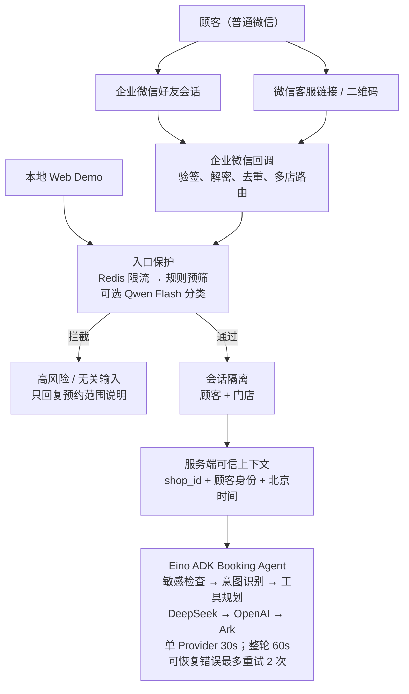
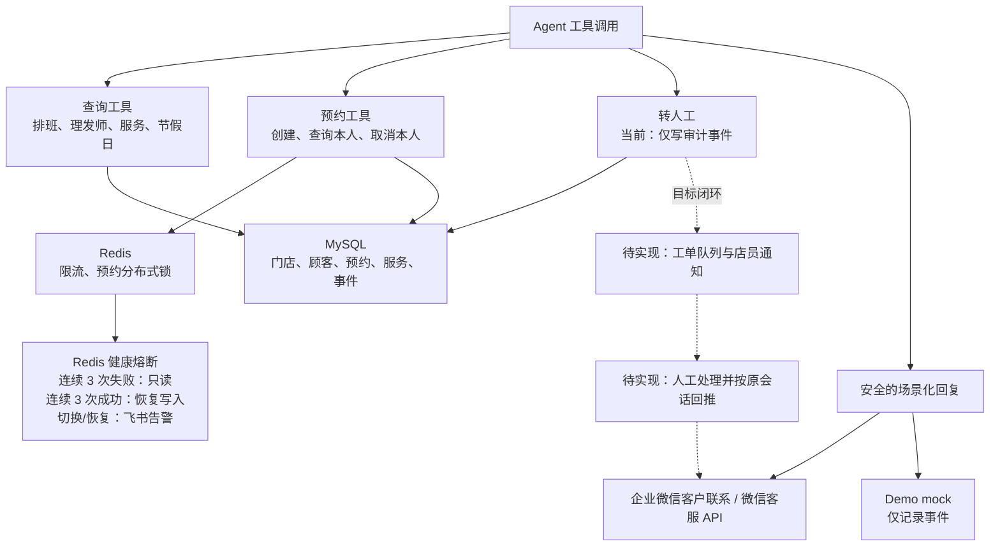
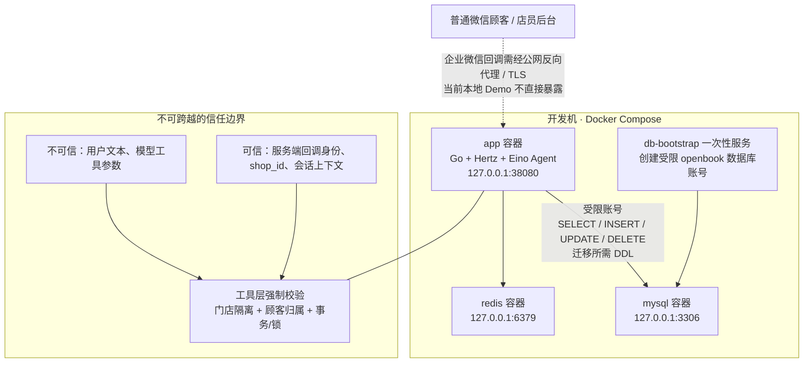

# OpenBook 架构图

> 项目定位：顾客使用普通微信说一句话完成预约。企业微信仅提供商家侧“客户联系 / 微信客服”接入能力，顾客无需安装企业微信。

## 1. 运行时请求链路

第一张图只描述“消息如何进入 Agent”；数据落库、回复与人工闭环见下一张图。拆分后在 Markdown 预览中可直接阅读，无需缩放整张图。

> 虚线和“待实现”节点表示建议补齐的人工交接闭环，并非当前代码已有能力。当前 `handoff_to_human` 只写 `event_logs`，不会自动通知店员或把人工处理结果异步发回顾客。

> Redis 进入只读保护后，查询工具仍可用；创建预约、取消预约和转人工会被拒绝，防止在锁不可用时继续写入。Redis 初始化失败、切入只读和恢复写入都会向已配置的 `FEISHU_ALERT_WEBHOOK_URL` 发送通知。

## 2. 安全与部署边界

## 3. 演示时的讲解顺序（60–90 秒）

1. 顾客从普通微信进入，再分流到店员企业微信好友会话或微信客服会话。
2. 两种入口在服务端统一成会话与可信身份上下文，并按门店隔离。
3. 限流后先做确定性输入相关性/风险评分；可选 Qwen Flash 只处理模糊分类，失败立即回退规则。提示注入、命令、广告、乱码和长无关文本只得到范围提示，不消耗 Agent 或工具资源。
4. Agent 只做自然语言理解和工具规划；关键词未命中时由可选小模型补充意图标签。创建预约由 Redis 时段锁和 MySQL 事务/唯一约束共同保护，回调去重之外仍有业务层并发防护。
5. 模型按 DeepSeek、OpenAI、Ark 尝试；单 provider 默认 30 秒，整轮默认 60 秒。可恢复错误（429、5xx、网络超时）最多重试 2 次，再切换；启动时全部 provider 不可用则只回复“AI 助手暂不可用”，不写业务数据。
6. 转人工目前仅留审计埋点；上线前应接入队列/工单、店员通知及原会话异步回推，形成可追踪闭环。
7. 安全上，顾客 Agent 没有 Shell、文件、任意 SQL 或后台权限；查询/取消预约必须校验门店、身份与归属。
8. 本地 Demo 使用 Compose 和 mock 回复；部署公网时才需要额外配置反向代理、TLS、密钥托管与企业微信回调地址。

## 4. 图中真实代码入口

- 消息入口与双通道：`server/server.go`
- 输入相关性/风险阈值：`server/input_trust.go`
- Qwen Flash 小模型分类适配：`chatmodel/small.go`、`server/input_trust_llm.go`
- 限流：`server/ratelimit.go`
- Agent 编排与工具白名单：`internal/agent/agent.go`
- 模型超时、运行时切换与降级回复：`chatmodel/model.go`、`chatmodel/fallback.go`
- 预约 Redis 时段锁与事务落库：`tools/create_appointment.go`、`storage/repo.go`
- 当前转人工限制（仅埋点）：`tools/handoff_to_human.go`
- 顾客预约归属校验：`tools/get_appointment.go`、`tools/cancel_appointment.go`
- 事务取消策略：`storage/cancel_policy.go`
- Docker 与受限数据库账号：`docker-compose.yml`
